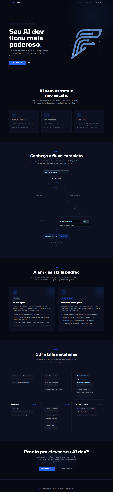

# FacioFlow Skills — Ecossistema Claude Code

**38 skills · 3 stacks · audit híbrido Opus 4.7**

> Pipeline estruturado que transforma o Claude Code num engenheiro com processo, memória e critério estético. Não é uma ferramenta — é um método com resultado demonstrável.

---



*`facioflow-v3` — LP de 7 seções construída em 1 sessão, auditada com Opus 4.7 e refinada via 6 subagentes em paralelo.*

---

## O resultado

Numa única sessão, o pipeline produziu:

- **Landing page completa** com hero SVG animado, 3 mini-pipelines por stack, before/after terminal-style, 38 skills no arsenal
- **Audit híbrido** (código + 7 screenshots Playwright): **38 findings** via 3 skills formais vs 22 via Opus direto — a diferença é o que as skills adicionam
- **6 subagentes Opus 4.7 em paralelo** aplicando fixes em **67 segundos**
- **Zero regressões** — cada task com spec review + code quality review antes de fechar

O mesmo Claude Code, sem skills, teria entregado layout genérico, sem processo e sem memória entre sessões. Com o pipeline, cada decisão tem registro, cada sessão acumula contexto.

---

## Como funciona

```
usando-superpowers (governa tudo)
       ↓
brainstorming → spec aprovado pelo usuário
       ↓
[decision tree por tipo de projeto]
       ↓
    LP/componente:                    App/Dashboard:
    frontend-design                   frontend-design
       ↓                                 ↓
    build iterativo               writing-plans
    (ui-subagent Opus executa)        ↓
                                  subagent-driven-development
                                  ├─ UI tasks → ui-subagent (Opus 4.7)
                                  └─ lógica  → subagente genérico
       ↓                                 ↓
       └──────────┬──────────────────────┘
                  ↓
        frontend-audit-gate ← OBRIGATÓRIO
          Step 0: webapp-testing → screenshots Playwright
          Steps 1-3: redesign + web-guidelines + svg-animations
          (código + visual cruzados pelo Opus)
                  ↓
        aplicação dos fixes (manual ou paralelo via ui-subagent)
                  ↓
        finishing-a-development-branch
```

**Regra inviolável:** qualquer trabalho visual (HTML, CSS, SVG, animações) vai para o `ui-subagent` Opus 4.7. A sessão principal (Sonnet) coordena e revisa; o Opus executa.

---

## Os 3 stacks

### Frontend
`brainstorming` → `frontend-design` → build iterativo → `frontend-audit-gate` (híbrido) → `finishing`

Skills especialistas: `design-taste-frontend` · `svg-animations` · `web-design-guidelines` · `redesign-existing-projects` · `vercel-*`

### n8n
`n8n-mcp-tools-expert` → `n8n-workflow-patterns` → `n8n-node-configuration` → `n8n-validation-expert` → `n8n-workflow-testing`

### Supabase
`supabase` → `supabase-postgres-best-practices` → `supabase-schema-testing` → migration

---

## Arsenal — 38 skills

| Categoria | Skills | Origem |
|---|---|---|
| **Pipeline & Process** | `using-superpowers` `brainstorming` `frontend-design` `writing-plans` `executing-plans` `subagent-driven-development` `verification-before-completion` `finishing-a-development-branch` | obra/superpowers + anthropics |
| **Frontend Specialty** | `design-taste-frontend` `svg-animations` `web-design-guidelines` `redesign-existing-projects` `full-output-enforcement` `vercel-composition-patterns` `vercel-react-best-practices` `vercel-react-view-transitions` `frontend-audit-gate`★ | leonxlnx + vercel-labs + supermemoryai + custom |
| **Quality** | `systematic-debugging` `test-driven-development` `requesting-code-review` `receiving-code-review` `dispatching-parallel-agents` `webapp-testing` | obra/superpowers + anthropics |
| **Stack: Supabase** | `supabase` `supabase-postgres-best-practices` `supabase-schema-testing`★ | supabase/agent-skills + custom |
| **Stack: n8n** | `n8n-workflow-patterns` `n8n-mcp-tools-expert` `n8n-node-configuration` `n8n-validation-expert` `n8n-expression-syntax` `n8n-code-javascript` `n8n-code-python` `n8n-workflow-testing`★ | czlonkowski/n8n-skills + custom |
| **Git & Branches** | `finishing-a-development-branch` `using-git-worktrees` | obra/superpowers |
| **Meta & Memory** | `find-skills` `checkpoint`★ `writing-skills` `remember:remember` | obra/superpowers + dpt-plugins + vercel-labs |

★ custom — criada neste projeto

**Subagente custom:** `ui-subagent` (Opus 4.7 fixo, tools restritas a Read/Edit/Write — foco total em código visual)

Referência completa com quando ativa, como conecta e padrões de uso: **[`docs/SKILLS.md`](docs/SKILLS.md)**

---

## Estrutura do projeto

```
skill-claude-code/
├── README.md                        ← você está aqui
├── CLAUDE.md                        ← decision tree do pipeline (lido pelo Claude Code)
├── assets/                          ← brand assets FacioFlow (SVGs, logos, PDF)
├── docs/
│   ├── SKILLS.md                    ← referência completa das 38 skills
│   ├── audits/                      ← relatórios do frontend-audit-gate + screenshots
│   └── superpowers/specs/           ← design specs (output do brainstorming)
├── facioflow-v3/                    ← LP v3 — 3 stacks, loaders orgânicos (ativa)
├── skills-landing/                  ← LP v1 — referência histórica
├── scripts/
│   └── audit_visual.mjs             ← captura screenshots via Playwright (porta 8080)
├── .claude/
│   ├── agents/ui-subagent.md        ← subagente UI Opus 4.7
│   └── skills/                      ← skills custom
└── .agents/skills/                  ← skills instaladas via marketplace
```

---

**Feito por:** Carlos · [casa-do-rodo](https://github.com/casa-do-rodo)  
**Stack:** Claude Code (Sonnet 4.6 + Opus 4.7) · skills marketplace · humano no loop
